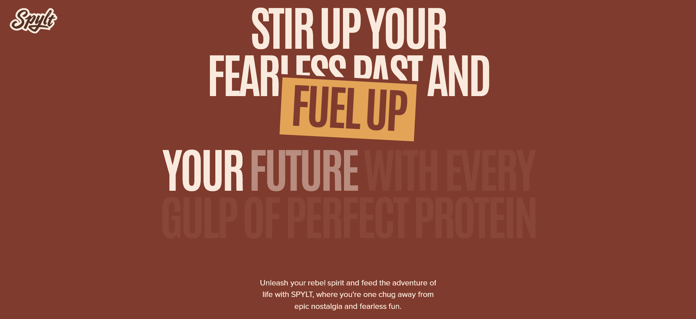

# 🌟 Animated Landing Page — React + Vite + GSAP

A visually rich, fully animated, and highly interactive landing page built with **React**, powered by **GSAP**, **ScrollTrigger**, and a modular section-based design.  
This project focuses on smooth motion, immersive storytelling, scroll-based interactions, and premium UI presentation.

---

## 🚀 Overview

This landing page is crafted as a cinematic, animated interface featuring:

- Fluid GSAP animations  
- Scroll-triggered transitions  
- Pinned video sequences  
- Horizontal flavor sliders  
- Clip-path title reveals  
- Responsive mobile/desktop behavior  
- Smooth “easy scroll–like” experience through scrubbed timelines  

The codebase is clean, scalable, and split into modular components and sections.

---

## ✨ Key Features

### 🎞 GSAP Animation System
Powered by:
- **GSAP Timeline**
- **ScrollTrigger**
- Scrub-based motion
- Pinned scroll scenes
- Fade, scale, transform, and clip-path effects
- Scroll-synced storytelling

### 📽 Video Pinning Section
The `VideoPinSection` implements:
- ScrollTrigger pinning  
- Progressive zoom animations  
- Multi-step GSAP timelines  
- Immersive fullscreen video presentation  

### 🍓 Horizontal Flavor Slider
The `FlavorSlider` includes:
- Horizontal scroll animation synced with GSAP  
- Auto-calculation of scrollable width  
- Device-aware behavior with `react-responsive`  
- Smooth left–right transitions  

### 🎨 ClipPath Title Animation
Custom title reveal animations using:
- Dynamic **clip-path** shapes  
- Soft GSAP easing  
- Timed stagger effects  

### 🧭 Easy-Scroll Experience
Although it doesn’t use an external smooth-scroll library, the page creates a similar effect using:
- GSAP scrubbing  
- Gradual timeline curves  
- Scroll-based interpolation  

### 🧩 Modular Component Architecture
Every animated element is isolated inside reusable components, ensuring maintainability and easy feature expansion.

---

## 📁 Project Structure

/
├── App.jsx
├── main.jsx
├── index.css

├── components/
│ ├── ClipPathTitle.jsx
│ ├── FlavorSlider.jsx
│ ├── FlavorTitle.jsx
│ ├── NavBar.jsx
│ └── VideoPinSection.jsx

├── sections/
│ ├── HeroSection.jsx
│ ├── BenefitSection.jsx
│ ├── FlavorSection.jsx
│ ├── NutritionSection.jsx
│ ├── MessageSection.jsx
│ ├── TestimonialSection.jsx
│ └── FooterSection.jsx

└── constants/
└── index.js


---

## 🛠 Technologies Used

### Core
- **React + Vite**
- **JavaScript (ES6+)**
- **CSS**
- **React Responsive**

### Animation
- **GSAP**
- **GSAP ScrollTrigger**
- **useGSAP React Hook**

### Architecture
- Section-based layout  
- Reusable UI components  
- Data-driven content via constants  

---

## 🔧 Installation & Setup

### **1. Clone the repository**
``` bash
git clone https://github.com/your-username/your-repo-name.git
cd your-repo-name
```

### **2. Install dependencies**

``` bash
npm install
```

### **3. Start the development server**

``` bash
npm run dev
```

---

## 📸 Screenshots  
All screenshots below are automatically loaded from the `/Demo` directory.

### 🖼 Preview Gallery





---
## 📦 Build for Production

``` bash
npm run build
```
---
## 📝 License

You may add a license section here if needed (MIT recommended).


